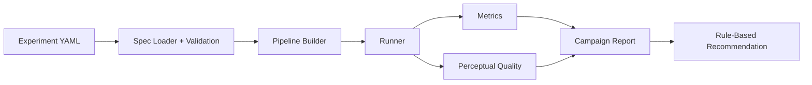

# Luxonis Perception Deployment Lab

A modular experimentation framework for designing, running, benchmarking, and recommending perception pipeline configurations on **Luxonis / DepthAI** devices.

## Overview

## System flow



This repository implements an end-to-end lab for evaluating perception pipelines at the **system level**. Rather than stopping at “the model runs,” it focuses on the full deployment loop:

- declarative experiment definition,
- reproducible pipeline construction,
- live and replay execution,
- quantitative profiling,
- perceptual validation,
- campaign-scale benchmarking,
- report generation,
- and automated recommendation.

The MVP pipeline around which the project was built is:

```text
Camera → ImageManip → DetectionNetwork → ObjectTracker → Output
```

It is evaluated by varying:

- resolution,
- resize strategy,
- tracker on/off,
- confidence threshold.

---

## Why this project matters

Most vision demos answer only one question:

> Does the model run?

This project is built to answer the questions that matter during deployment:

- Which pipeline variant is the best trade-off?
- How much perceptual stability does tracking add?
- Is a small FPS loss worth a gain in continuity and consistency?
- Do `crop`, `letterbox`, or `stretch` produce better deployment behavior?
- How can multiple configurations be compared reproducibly and documented clearly?

This makes the repository more than an inference demo. It is a **deployment evaluation and decision framework** for Luxonis perception pipelines.

---

## Core capabilities

### Declarative experiment specification

Experiments are defined in YAML and loaded into typed, validated Python objects.

Example:

```yaml
experiment:
  name: mvp_replay_baseline
  input_source: replay_video
  scenario: indoor_corridor
  duration_seconds: 30
  replay_path: "data/replay/baile.mp4"

pipeline:
  camera:
    resolution: "1080p"
    fps: 30

  imagemanip:
    resize_mode: "letterbox"
    output_size: [512, 384]

  nn:
    type: "detection"
    model_name: "yolov6n"
    confidence_threshold: 0.35

  tracker:
    enabled: true

outputs:
  live_view: true
  save_video: true
  save_metrics: true
  save_events: true
```

This creates a clean contract:

```text
YAML → loader → validation → PipelineSpec → pipeline builder → execution
```

### Modular pipeline construction

The pipeline is assembled from specialized modules that separate responsibilities across:

- live camera input,
- replay input,
- preprocessing,
- detection,
- tracking,
- and pipeline metadata.

This keeps the codebase extensible and easier to evolve than an ad hoc script-based implementation.

### Live runner

The project supports real-time execution on an OAK device with:

- live visualization,
- bounding boxes,
- labels,
- confidence scores,
- track IDs,
- FPS overlay,
- optional video recording.

Typical command:

```bash
python -m src.main --config configs/experiments/mvp_live.yaml
```

### Replay runner

The project also supports reproducible replay on recorded video through `ReplayVideo`, enabling:

- repeated evaluation on identical input,
- fair comparison across variants,
- output video export,
- session manifests for traceability.

Typical command:

```bash
python -m src.main --config configs/experiments/mvp_replay.yaml
```

### Automatic variant generation

From a base configuration and a parameter sweep, the system can generate a full campaign of concrete pipeline variants.

Current sweep dimensions include:

- resolution: `720p`, `1080p`
- resize mode: `crop`, `letterbox`, `stretch`
- tracker: `true`, `false`
- confidence threshold: `0.25`, `0.35`, `0.50`

Typical command:

```bash
python -m src.variant_generator.generate_variants   --sweep configs/variants/mvp_sweep.yaml
```

### Batch campaign execution

The campaign runner executes a full or partial campaign incrementally.

It supports:

- reading `campaign_manifest.json`,
- sequential execution of variant specs,
- safe resume behavior,
- skipping already completed variants,
- campaign execution summaries.

Typical command:

```bash
python -m src.runner.campaign_runner   --campaign-manifest outputs/variants/<campaign_id>/campaign_manifest.json
```

Partial execution:

```bash
python -m src.runner.campaign_runner   --campaign-manifest outputs/variants/<campaign_id>/campaign_manifest.json   --limit 10
```

`--limit N` means “execute up to N new variants,” not “use only the first N entries in the manifest.”

### Profiling

Each run produces quantitative metrics such as:

- average FPS,
- total duration,
- frame interval statistics,
- detections per event,
- tracks per event.

Typical output:

```text
outputs/metrics/<variant_id>.json
```

### Perceptual validation

Beyond performance, the system estimates perceptual quality through metrics such as:

- detection count variation,
- bounding-box jitter across events,
- track ID continuity,
- track fragmentation,
- overall perceptual quality score.

Typical output:

```text
outputs/metrics/<variant_id>_quality.json
```

### Campaign reporting

Campaign results can be turned into a readable Markdown report including:

- campaign summary,
- variant overview table,
- resize-mode comparison,
- tracker comparison,
- resolution comparison,
- final recommendation.

Typical command:

```bash
python -m src.reporting.build_report   --campaign-manifest outputs/variants/<campaign_id>/campaign_manifest.json
```

Typical output:

```text
outputs/reports/<campaign_id>.md
```

### Rule-based recommendation

On top of metrics and perceptual scores, the project includes a rule-based recommendation layer.

It considers:

- perceptual quality,
- normalized FPS,
- tracker vs. no-tracker trade-offs,
- resize-mode performance,
- and produces a recommended configuration plus interpretable insights.

Typical command:

```bash
python -m src.recommender.recommend   --campaign-manifest outputs/variants/<campaign_id>/campaign_manifest.json
```

Typical output:

```text
outputs/reports/<campaign_id>_recommendation.json
```

---

## System architecture

```text
Config YAML
   ↓
PipelineSpec + Validation
   ↓
Pipeline Builder
   ↓
Runner (live / replay / campaign)
   ↓
Metrics + Quality
   ↓
Reporting
   ↓
Recommendation
```

This keeps the following concerns clearly separated:

- definition,
- execution,
- measurement,
- interpretation,
- decision-making.

---

## Repository structure

```text
luxonis-perception-deployment-lab/
├── .gitignore
├── pyproject.toml
├── README.md
├── requirements.txt
│
├── configs/
│   ├── experiments/
│   │   ├── mvp_live.yaml
│   │   └── mvp_replay.yaml
│   ├── scenarios/
│   └── variants/
│       └── mvp_sweep.yaml
│
├── data/
│   ├── raw_videos/
│   ├── replay/
│   │   ├── baile.mp4
│   │   └── ...
│   └── sample_media/
│
├── docs/
│   └── mvp_definition.md
│
├── outputs/
│   ├── metrics/
│   │   ├── <variant_id>.json
│   │   └── <variant_id>_quality.json
│   ├── reports/
│   │   ├── <variant_id>_manifest.json
│   │   ├── <campaign_id>_execution.json
│   │   ├── <campaign_id>.md
│   │   └── <campaign_id>_recommendation.json
│   ├── snapshots/
│   ├── variants/
│   │   └── campaign_<timestamp>/
│   │       ├── campaign_manifest.json
│   │       └── specs/
│   │           ├── variant_001_....yaml
│   │           ├── variant_002_....yaml
│   │           └── ...
│   └── videos/
│       ├── live_run.mp4
│       ├── <variant_id>.mp4
│       └── ...
│
├── scripts/
│
├── src/
│   ├── __init__.py
│   ├── main.py
│   ├── cli/
│   ├── pipeline_builder/
│   │   ├── build_pipeline.py
│   │   ├── camera_factory.py
│   │   ├── input_factory.py
│   │   ├── model_resolver.py
│   │   ├── nn_factory.py
│   │   ├── replay_factory.py
│   │   ├── tracker_factory.py
│   │   └── types.py
│   ├── pipeline_spec/
│   │   ├── load_spec.py
│   │   ├── models.py
│   │   └── validators.py
│   ├── profiler/
│   │   ├── __init__.py
│   │   ├── metrics.py
│   │   ├── pipeline_timing.py
│   │   └── system_probe.py
│   ├── recommender/
│   │   ├── __init__.py
│   │   ├── recommend.py
│   │   └── rules.py
│   ├── recorder_replay/
│   │   ├── replay_io.py
│   │   └── session_manifest.py
│   ├── reporting/
│   │   ├── __init__.py
│   │   ├── build_report.py
│   │   ├── plots.py
│   │   └── templates.py
│   ├── runner/
│   │   ├── campaign_progress.py
│   │   ├── campaign_runner.py
│   │   ├── live_runner.py
│   │   ├── output_writer.py
│   │   ├── render.py
│   │   ├── run_variant.py
│   │   └── video_runner.py
│   ├── validator/
│   │   ├── __init__.py
│   │   ├── detection_stability.py
│   │   ├── run_quality.py
│   │   └── tracking_stability.py
│   └── variant_generator/
│       ├── __init__.py
│       └── generate_variants.py
│
└── tests/
```

### Quick directory guide

- `configs/`: experiment definitions and parameter sweeps.
- `src/pipeline_spec/`: YAML loading, validation, and typed spec objects.
- `src/pipeline_builder/`: concrete DepthAI pipeline construction.
- `src/runner/`: live, replay, and campaign execution.
- `src/profiler/`: quantitative runtime metrics.
- `src/validator/`: perceptual stability evaluation.
- `src/reporting/`: campaign report generation.
- `src/recommender/`: configuration recommendation logic.
- `src/variant_generator/`: automatic campaign generation.
- `outputs/`: generated artifacts.

---

## Recommended workflow

### 1. Run the live baseline

```bash
python -m src.main --config configs/experiments/mvp_live.yaml
```

### 2. Run the replay baseline

```bash
python -m src.main --config configs/experiments/mvp_replay.yaml
```

### 3. Generate a variant campaign

```bash
python -m src.variant_generator.generate_variants   --sweep configs/variants/mvp_sweep.yaml
```

### 4. Execute campaign variants

```bash
python -m src.runner.campaign_runner   --campaign-manifest outputs/variants/<campaign_id>/campaign_manifest.json
```

### 5. Build the campaign report

```bash
python -m src.reporting.build_report   --campaign-manifest outputs/variants/<campaign_id>/campaign_manifest.json
```

### 6. Generate the recommendation

```bash
python -m src.recommender.recommend   --campaign-manifest outputs/variants/<campaign_id>/campaign_manifest.json
```

---

## Artifacts produced by the system

Typical outputs include:

```text
outputs/variants/campaign_<id>/campaign_manifest.json
outputs/variants/campaign_<id>/specs/*.yaml
outputs/metrics/<variant_id>.json
outputs/metrics/<variant_id>_quality.json
outputs/reports/<variant_id>_manifest.json
outputs/reports/<campaign_id>_execution.json
outputs/reports/<campaign_id>.md
outputs/reports/<campaign_id>_recommendation.json
outputs/videos/live_run.mp4
outputs/videos/<variant_id>.mp4
```

---

## Current project state

The repository already covers the full loop from:

- declarative configuration,
- live/replay execution,
- campaign generation,
- batch execution,
- profiling,
- perceptual validation,
- reporting,
- and recommendation.

In practice, the repo already functions as a **complete experimentation and decision lab** for Luxonis perception pipelines.

---

## What can be added next

This core is stable enough to support future extensions such as:

- full campaign coverage across all remaining variants,
- richer dashboards or HTML reporting,
- automatic side-by-side visual comparisons,
- representative snapshot extraction,
- stage-level latency instrumentation,
- backend abstraction for model artifacts,
- support for:
  - ONNX
  - OpenVINO
  - TFLite where appropriate
  - TensorRT on local GPU
- future integration with:
  - Luxonis HubAI
  - ModelConverter
  - `.blob`
  - `.superblob`
  - `.dlc`
- exploration of deployment targets such as:
  - RVC2
  - RVC3
  - RVC4
- more advanced recommenders:
  - multi-objective
  - scenario-aware
  - learning-based

---

## Environment notes

This project was developed and validated in an environment similar to:

- Ubuntu
- Python 3.12
- Git
- Docker available
- Luxonis / OAK-1 device
- DepthAI v3 style APIs

---

## Operational notes

### Replay still depends on Luxonis hardware

Even when the input is a recorded video, the pipeline still executes on device, so replay mode still depends on the Luxonis hardware path.

### Qt / OpenCV font warnings

In some environments you may see warnings such as:

```text
QFontDatabase: Cannot find font directory ...
```

These were treated as environment/UI warnings rather than blocking failures.

---

## Author

Rolando Cortez

---

## License

MIT
